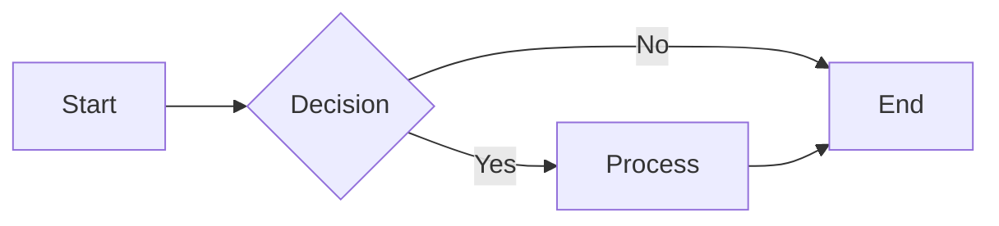
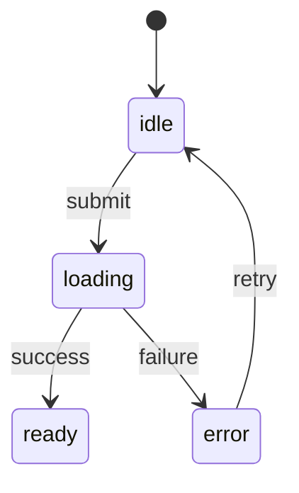
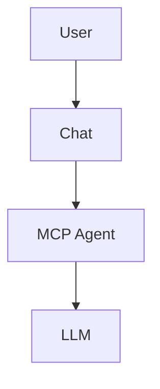

# @ux3/plugin-diagrams

Mermaid-lite diagram renderer for UX3 markdown. Zero dependencies, lightweight, and fully integrated with the markdown rendering pipeline.

## Features

- **Zero dependencies** — 8–12KB gzipped, no transitive deps
- **Automatic integration** — Works with markdown code fences (` ``` mermaid `)
- **Supported diagrams**: Flowchart, State Machine, Sequence (WIP), ER (WIP)
- **Multiple themes** — light, dark, minimal (CSS custom properties)
- **Lazy rendering** — Uses IntersectionObserver for off-screen diagrams
- **Security-first** — No eval, input validation, sanitized output
- **Responsive** — Handles mobile viewports, touch-friendly

## Usage

### In Markdown

````markdown
## System Flow


````

### Dogfooding UX3 Patterns



This is the canonical UX3 view FSM lifecycle pattern, rendered with the same diagram pipeline we use for app docs.

### Per-Diagram Configuration



### Programmatic

```typescript
import { MermaidParser, LayeredLayout, MermaidRenderer, getTheme } from '@ux3/plugin-diagrams'

const source = `
  flowchart TD
    A[Start] --> B[End]
`

const diagram = new MermaidParser().parse(source)
const layout = new LayeredLayout().compute(diagram, diagram.config)
const renderer = new MermaidRenderer(getTheme('light'))
const svg = renderer.render(diagram, layout)

document.body.appendChild(svg)
```

### Custom Element

```html
<ux-diagram data-theme="dark">
flowchart LR
  A --> B --> C
</ux-diagram>
```

### UX3 App Diagram Element

```html
<ux-diagram-ux3 type="fsm" data-theme="dark"></ux-diagram-ux3>
```

Supported built-in types:
- `fsm` — canonical UX3 state lifecycle
- `route` — router/view route flow
- `plan` — planner pipeline
- `ux` / `app` — UX3 architecture overview

## Configuration

### Plugin Installation (ux3.yaml)

```yaml
plugins:
  - name: '@ux3/plugin-diagrams'
    config:
      theme: light                          # default theme
      enableCache: true
      maxNodes: 10000
      maxEdges: 50000
```

### Theme Customization

The plugin exposes CSS custom properties for theming:

```css
:root {
  --mermaid-primary: #f0f0f0;
  --mermaid-secondary: #333;
  --mermaid-tertiary: #fff;
  --mermaid-text: #333;
  --mermaid-border: #ccc;
  --mermaid-border-width: 2px;
  --mermaid-border-radius: 4px;
  --mermaid-font-size: 14px;
  --mermaid-font-family: system-ui, sans-serif;
}
```

## Architecture

```
Parser (tokenize + recursive descent)
  ↓
Semantic Validator (check node refs, cycles)
  ↓
Layout Engine (Sugiyama layered or force-directed)
  ↓
SVG Renderer (DOM API, never innerHTML)
  ↓
Styled Container (CSS custom properties)
```

## Supported Diagram Types

### Tier 1 (Production Ready)
- **Flowchart** — nodes, edges, labels, multiple shapes (rect, circle, diamond, cylinder, etc.)
- **State Machine** — states, transitions, guards

### Tier 2 (Complete)
- **Sequence** — participants, messages, loops
- **Entity-Relationship** — entities, cardinality (crow's foot)
- **Class** — classes, inheritance, composition
- **Gantt** — simple timeline bars

## Security

- **No eval** — Pure parsing and DOM construction
- **Input validation** — Whitelist node IDs, labels, max sizes
- **Safe rendering** — `createElementNS()` for SVG, escaped text nodes, no HTML injection
- **Size limits** — Max 10k nodes, 50k edges, 5MB source

## Performance

- **Small diagrams** (<100 nodes): <50ms render
- **Medium diagrams** (100–1000 nodes): <500ms render
- **Large diagrams** (>10k nodes): rejected with user-friendly error
- **Caching** — Parsed diagrams cached by source hash

## Integration with @ux3/plugin-chat

The diagram renderer automatically integrates with the markdown rendering pipeline. When `@ux3/plugin-chat` encounters a code block with language `mermaid`, it calls the plugin's renderer and embeds the SVG directly.

No additional configuration needed — the plugin hooks in automatically via `app.markdown.registerCodeBlockRenderer()`.

## Browser Support

- Chrome/Edge 90+
- Firefox 88+
- Safari 14+
- Mobile browsers (iOS 14+, Android 9+)

Uses IntersectionObserver for lazy rendering. Fallback to immediate render if not available.

## Future Extensions (v2+)

- Interactive features (pan/zoom, click to expand)
- Export formats (PNG, PDF via canvas fallback)
- Git graph, C4 diagrams, Sankey
- Timeline and Pie charts
- Real-time collaboration (server-side)

## Troubleshooting

### Diagram not rendering

1. Check browser console for parse errors
2. Verify DSL syntax (compare with examples above)
3. Check node IDs are alphanumeric (no spaces)
4. Ensure no circular references in flowcharts (except explicitly allowed in state diagrams)

### Diagram looks wrong

1. Check theme: `data-theme="light|dark|minimal"`
2. Verify CSS custom properties are not overridden globally
3. Try resizing container to trigger responsive layout

### Performance issues

1. Limit to <10k nodes
2. Use force-directed layout for large diagrams (auto-selected)
3. Enable caching: `enableCache: true` in plugin config

## License

Same as UX3 framework.
