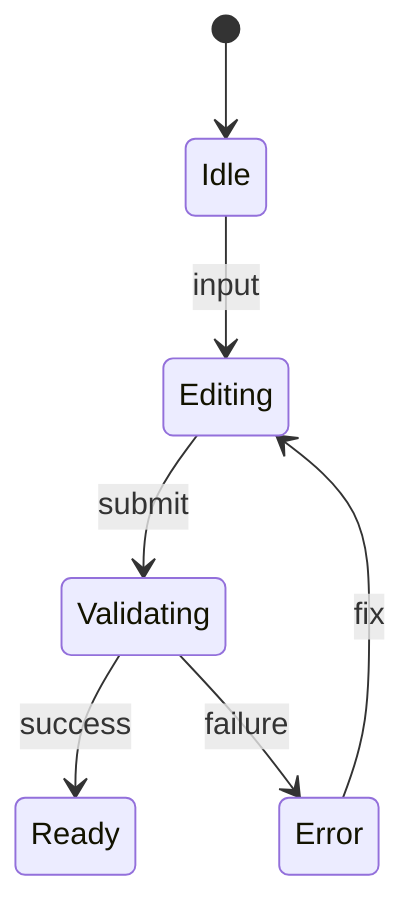

This chapter examines developer ergonomics for FSM-based UI authoring.

Declarative state definitions in YAML and HTML make machine structure visible. Developers can review the full state graph in source, which reduces the need to trace imperative event handlers through multiple files.

Tooling for visualization, debugging, replay, and live inspection is critical. An explicit machine model enables tools to show active states, available transitions, recent events, and contextual snapshots. This makes it easier to diagnose why a widget is not behaving as expected and why an agent proposal would change a particular transition.

Reset semantics and state isolation are also important ergonomics concerns. Explicit session state allows developers to clear history, replay prior interactions, or steer an in-flight workflow without losing the machine model. The result is an ergonomic story that is stronger than statecharts alone: the runtime becomes introspectable and correctable while it is still live.
